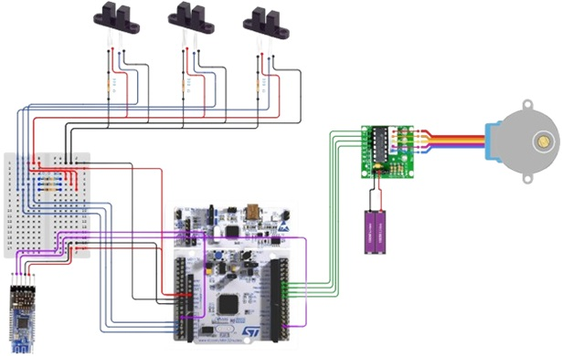

## Personal-Project_Elevator_Project

### 1. 목적
- App을 통해 제어할 수 있는 엘리베이터 제작을 통한 STM32 MCU,광차단센서, Step Motor, App Invertor 제작 및 이해

  

### 2. 프로젝트의 목표
- 스텝 모터와 광차단센서를 활용하여 엘리베이터를 원하는 층으로 이동할 수 있도록 구현
- 앱을 통해 엘리베이터를 제어할 수 있도록 구현 

  

### 3. Hardware Diagram

  

  

### 4. System Diagram

  

  

### 5. MIT App Inventor

  
   
  

  

  

### 5. Implementation

  

